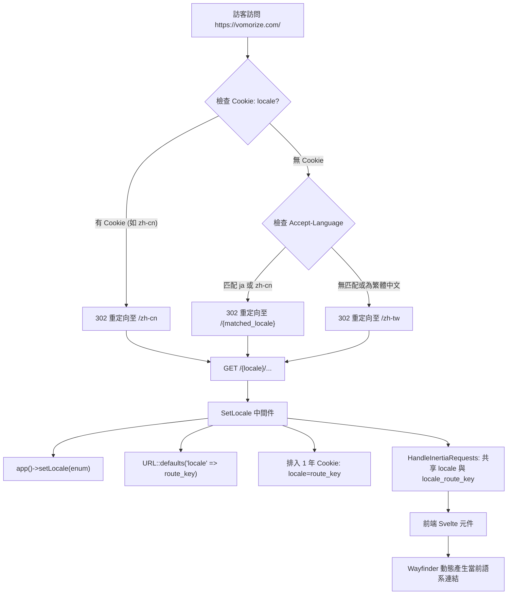

# URL-based 多語系路由架構變更說明文件

本文件詳細說明專案中針對 **URL-based 多語系架構（`/{locale}/...`）** 所進行的所有程式碼變更、設計目的與核心用途。

---

## 變更背景與目標

原本的多語系實作仰賴前端瀏覽器的 `localStorage` 與 HTTP Request Header 中的 `Accept-Language`，網址列並無語系前綴（例如所有語系共用 `/`、`/login`）。

### 主要痛點：
1. **不利於 SEO**：搜尋引擎爬蟲無法透過固定、獨立的 URL 檢索與收錄不同語言版本的頁面內容。
2. **狀態不同步與閃爍**：前端讀取 `localStorage` 與後端渲染的初始語言不一致時，可能導致畫面文字切換閃爍。
3. **分享連結問題**：用戶分享網址給他人時，無法精確指定對方看到的語系。

### 重構目標：
1. **網址為單一真相來源（Single Source of Truth）**：所有前台公開、認證與學習頁面均掛載於 `/{locale}/...` 前綴下（支援 `zh-tw`、`zh-cn`、`ja`）。
2. **智慧根目錄導向（`/` 302 Redirection）**：造訪根網址 `https://vomorize.com/` 時，自動依據使用者的偏好 Cookie $\rightarrow$ 瀏覽器 `Accept-Language` $\rightarrow$ 預設繁體中文（`zh-tw`）智慧導向。
3. **長效語系偏好記憶**：透過 1 年長效 Cookie 記住使用者所選語系，即使關閉瀏覽器數週後再次造訪根網址，也能自動跳轉至上次選擇的語言。
4. **前後端語系自動同步**：後端翻譯、驗證訊息、URL 輔助函數與前端 Inertia 共享狀態完全一致。

---

## 檔案變更清單與詳細用途

### 1. 後端路由配置

#### `routes/web.php`
- **變更內容**：
  - 新增根路徑 `GET /` 轉址路由：依序檢查 `locale` Cookie、`Accept-Language` 標頭與預設值 `zh-tw`，執行 302 重定向至 `/{locale}`。
  - 將前台主要頁面（首頁 `home`、關卡 `levels.show`、群組學習 `groups.*`、自訂測驗 `quiz.custom` 等）包裹在 `Route::prefix('{locale}')->whereIn('locale', Locale::routeKeys())` 群組內。
  - 保留 GitHub OAuth 回調與進度同步 API 在未在地化路徑。
- **用途**：讓搜尋引擎與訪客能透過明確的語系前綴存取特定語言頁面，並提供友善的根目錄智慧跳轉。

#### `routes/fortify.php`
- **變更內容**：
  - 將所有 Laravel Fortify 認證頁面（`/login`、`/register`、`/forgot-password`、`/reset-password`、`/two-factor-challenge`、`/confirm-password`、`/email/verify`）包裹在 `{locale}` 前綴群組內。
- **用途**：確保登入、註冊、忘記密碼等認證頁面完全具備多語系網址支援。

---

### 2. 中間件與核心生命週期

#### `bootstrap/app.php`
- **變更內容**：
  - 調整 `web` 中間件群組順序，將 `SetLocale::class` 移至 `HandleInertiaRequests::class` 之前執行。
- **用途**：確保在 Inertia 共享全域 props 給前端之前，Laravel 應用程式的語系（`app()->setLocale()`）已經正確設定完畢。

#### `app/Http/Middleware/SetLocale.php`
- **變更內容**：
  - 解析當前路由參數中的 `{locale}`（如 `zh-tw`、`zh-cn`、`ja`）。
  - 將路由代碼轉換並呼叫 `app()->setLocale($matched->value)` 設定 Laravel 內部語系（`zh_TW`、`zh_CN`、`ja`）。
  - 呼叫 `URL::defaults(['locale' => $routeLocale])`，將當前語系設為所有命名路由的預設參數。
  - 寫入 1 年期長效 Cookie：`Cookie::queue('locale', $routeLocale, 525600)`。
- **用途**：
  - 統一後端翻譯與驗證錯誤訊息語系。
  - 使後端 `route('login')` 等輔助函數自動帶上當前語系，無需在每個 Controller 手動傳遞 `['locale' => ...]`。
  - 自動記錄使用者的語系偏好，供下次訪問根域名時使用。

#### `app/Http/Middleware/HandleInertiaRequests.php`
- **變更內容**：
  - 在 `share()` 方法中新增 `locale_route_key`（例如 `'zh-tw'`、`'zh-cn'`、`'ja'`）連同原有的 `locale`（`'zh_TW'`）一同共享給前端。
- **用途**：讓前端 Svelte 元件能直接讀取 kebab-case 的網址代碼，用於生成 Wayfinder 路由連結。

#### `app/Http/Responses/LoginResponse.php` 與 `RegisterResponse.php`
- **變更內容**：
  - 登入與註冊成功後的跳轉路徑改為使用當前語系的在地化首頁：`route('home', ['locale' => str_replace('_', '-', strtolower(app()->getLocale()))])`。
- **用途**：避免登入或註冊後跳轉丟失語系狀態。

---

### 3. 前端架構與狀態管理 (Svelte)

#### `resources/js/lib/locale.svelte.ts`
- **變更內容**：
  - 移除前端 `localStorage` 讀寫邏輯與 `initializeLocale()` 函式。
  - 重構 `currentLocale()`：直接從 Inertia 的 `page.props.locale` 取得目前語系。
  - 新增 `currentLocaleRouteKey()`：提供 kebab-case 格式（如 `zh-tw`）供前端路由使用。
- **用途**：徹底將 Single Source of Truth 轉移至 URL 與 Inertia Page Props，消除客戶端本地儲存可能產生的狀態分歧與閃爍。

#### `resources/js/app.ts`
- **變更內容**：
  - 移除 `initializeLocale()` 的呼叫。
- **用途**：簡化應用程式啟動流程。

#### `resources/js/components/LanguageSwitcher.svelte`
- **變更內容**：
  - 點選切換語言時，不再操作 `localStorage`，而是透過 `router.visit('/' + targetRouteKey)` 直接跳轉至目標語系的首頁（如 `/ja`、`/zh-cn`、`/zh-tw`）。
- **用途**：簡化切換語言流程，並讓瀏覽器重新載入對應語系的資料與路由。

#### 各前端頁面與導覽列元件
- **涉及檔案**：
  - `resources/js/components/AppNavbar.svelte`
  - `resources/js/pages/auth/Login.svelte`
  - `resources/js/pages/auth/Register.svelte`
  - `resources/js/pages/auth/ForgotPassword.svelte`
  - `resources/js/pages/auth/ResetPassword.svelte`
  - `resources/js/pages/Home.svelte`
  - `resources/js/pages/level/Show.svelte`
  - `resources/js/pages/groups/Show.svelte`
  - `resources/js/pages/groups/Introduce.svelte`
  - `resources/js/pages/groups/Quiz.svelte`
  - `resources/js/pages/groups/Result.svelte`
  - `resources/js/pages/quiz/Custom.svelte`
- **變更內容**：
  - 將原本寫死或缺少語系參數的路由呼叫（如 `register({ locale: 'zh-tw' })`、`href="/quiz/custom"`）全面改為動態傳入 `currentLocaleRouteKey()`（例如 `register({ locale: currentLocaleRouteKey() })`、`href={`/${currentLocaleRouteKey()}/quiz/custom`}`）。
- **用途**：保證使用者在網站內任何點擊、換頁、提交表單、重試測驗時，皆能維持在當前選擇的語系路徑下。

---

### 4. 測試套件更新

#### `tests/Feature/HomeLocalizationTest.php`
- **變更內容**：
  - 驗證根目錄 `GET /` 302 重定向：
    - `Accept-Language: ja` $\rightarrow$ 導向 `/ja`
    - `Accept-Language: zh-CN` $\rightarrow$ 導向 `/zh-cn`
    - 無標頭或未匹配 $\rightarrow$ 導向 `/zh-tw`
  - 驗證 Cookie 優先於 `Accept-Language` 標頭。
  - 驗證造訪特定語系路由（如 `/ja`）會排入 1 年期 `locale=ja` Cookie，並渲染日語內容。
- **用途**：確保多語系智慧導向與 Cookie 機制穩定可靠。

#### 認證與功能測試更新
- **涉及檔案**：
  - `tests/Feature/Auth/AuthenticationTest.php`
  - `tests/Feature/Auth/RegistrationTest.php`
  - `tests/Feature/Auth/PasswordResetTest.php`
  - `tests/Feature/Auth/EmailVerificationTest.php`
  - `tests/Feature/Auth/PasswordConfirmationTest.php`
  - `tests/Feature/Auth/TwoFactorChallengeTest.php`
  - `tests/Feature/Auth/VerificationNotificationTest.php`
  - `tests/Feature/Settings/ProfileUpdateTest.php`
  - `tests/Browser/RootPageTest.php`
  - `tests/Browser/LevelShowPageTest.php`
  - `tests/Browser/GroupOverviewPageTest.php`
  - `tests/TestCase.php`
- **變更內容**：
  - 更新測試中的請求路徑以包含 `{locale}` 前綴。
  - 在 `TestCase` 與測試中統一設定語系預設值。
- **用途**：保證全站 135 個測試（包含單元測試、功能測試與瀏覽器端 E2E 測試）全數通過，無回歸錯誤。

---

## 架構運作流程總覽

---

## 效益總結

1. **極佳的 SEO 支援**：每個語系擁有專屬 URL，搜尋引擎能索引多語言內容。
2. **無縫的使用者體驗**：初次訪問自動匹配語言，手動切換後長效記憶，再次訪問無痛跳轉。
3. **清晰的程式碼架構**：以 URL 為唯一真相來源，移除前端多餘的 `localStorage` 同步代碼，大幅降低維護成本與前後端語系不同步的風險。
